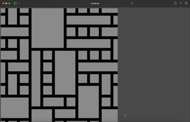

# Wave-Function-Collapse
這個是一個Wave-function-Collapse的作業demo。使用了p5.js。
在之後會重構整個code 。



### How-to-use
```bash 
git clone https://github.com/onon1101/wave-function-collapse.git
cd Wave-Function-Collapse

npm install
yarn start
```